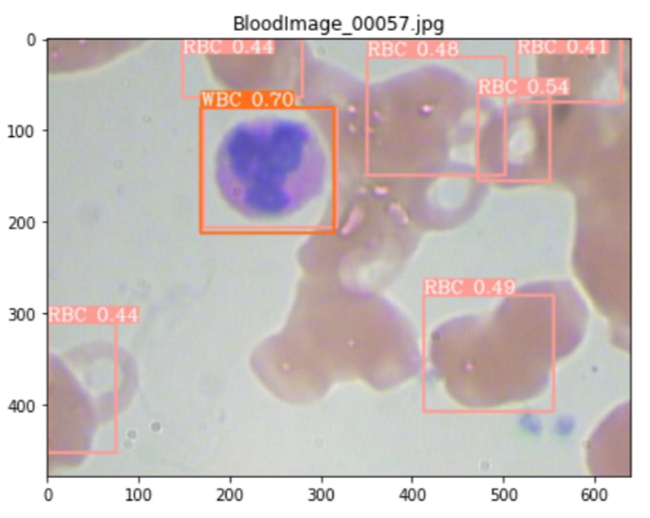

# Blood-Cell-Detection
 Detect blood cell such as RBC, WBC and platelets using BCCD Datasets.

 

## Environment

Dataset: Train Dataset 584, Test Dataset 216

 

## Preprocess Data

|                  训练样本的 X 均值和 Y 均值                  |                  训练样本的 X 均值和 Y 均值                  |
| :----------------------------------------------------------: | :----------------------------------------------------------: |
|  |  |

 

| 训练样本的血液细胞计数                                       | 测试样本的血液细胞计数                                       |
| :------------------------------------------------------------: | :------------------------------------------------------------: |
|  |  |

 

## Algorithm Flowchart

<h4 align="center">Fig 1: Algorithm flowchart based on K-Means with initialized centroids using mean values</h4>

 

## Result

#### Blood Cell Detection Result using K-Means

|             基于 K-Means 聚类方法的血液细胞检测              |
| :----------------------------------------------------------: |
|  |

 
|        Visualize K-Means Clustering in Train Dataset         |         Visualize K-Means Clustering in Test Dataset         |
| :----------------------------------------------------------: | :----------------------------------------------------------: |
|  |  |

####  Blood Cell Detection Result using SVM

| 模型类型                           |               基于 SVM 分类方法的血液细胞检测                |
| :----------------------------------: | :----------------------------------------------------------: |
| **基于自定义 SMO 的 SVM (RBF 核)** |  |
| **基于 sklearn 库的 SVM (RBF 核)** |  |

 

| 可视化训练样本的 SVM-RBF 分类                                | 可视化测试样本的 SVM-RBF 分类                                |
| :------------------------------------------------------------: | :------------------------------------------------------------: |
|  |  |

 

#### Blood Cell Detection Result using YOLOv6

|  |  |
| ------------------------------------------------------------ | ------------------------------------------------------------ |
|  |  |
|  |  |
|  |  |

 

| 基于 YOLOv6 分类方法的血液细胞检测                           |
| :------------------------------------------------------------: |
|  |
|  |

